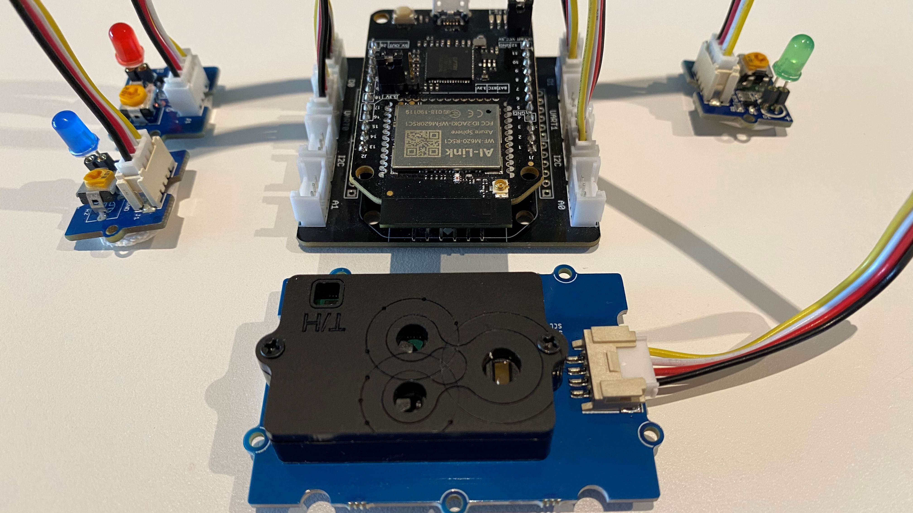

# Build a healthier workspace by tracking CO2 levels

How to build a healthier workspace by monitoring CO2, temperature, and humidity with [Azure Sphere](https://azure.microsoft.com/en-gb/services/azure-sphere/?WT.mc_id=julyot-co2-dglover), an SDC30 sensor and [Azure IoT Central](https://azure.microsoft.com/en-gb/services/iot-central/?WT.mc_id=julyot-co2-dglover).

## #JulyOT

This is part of the #JulyOT [IoT Tech Community](http://aka.ms/julyot) series.

| | |
|---|---|
||  |

**Follow** me on **Twitter** [@dglover](https://twitter.com/dglover)

---

## Are CO2 levels making you grumpy, sleepy, or sad

Working from home it is easy to close the door to shut out the noise of everyday life while we get on with work. Carbon dioxide is a byproduct of our breathing and closing the door can mean Carbon Dioxide (CO2) is building up in our workspaces impacting our wellbeing, concentration, and productivity levels.

For the science, then check out [The importance of Indoor Air Quality (IAQ) for Business Performance and Wellbeing](https://iotfactory.eu/the-importance-of-indoor-air-quality-iaq-for-business-performance-and-wellbeing/).

The problem is we can't see or smell Carbon Dioxide, it just keeps building up and we have no way of knowing it is happening other than getting tired or a headache. So with that in mind, I figured it was the Internet of Things to the rescue!

---

## The solution

I wanted to build a secure IoT device with [Azure Sphere](https://azure.microsoft.com/en-gb/services/azure-sphere/?WT.mc_id=julyot-co2-dglover) using the [Seeed Studio Grove CO2 & Temperature & Humidity Sensor](https://www.seeedstudio.com/Grove-CO2-Temperature-Humidity-Sensor-SCD30-p-2911.html) sensor I had in my box of bits. The folks at Sensirion made it super easy to port their [SCD30 driver](https://github.com/Sensirion/embedded-scd) to Azure Sphere. It was really just a matter of implementing the I2C read and write functions and providing an implementation for microsecond sleep. It just worked, and the ported driver is included in this project.

### Azure IoT Central

[Azure IoT Central](https://azure.microsoft.com/en-in/services/iot-central/?WT.mc_id=julyot-co2-dglover) provides an easy way to connect, monitor, and manage your Internet of Things (IoT) assets at scale.

I created a free trial of [Azure IoT Central](https://azure.microsoft.com/en-gb/services/iot-central/?WT.mc_id=julyot-co2-dglover) and in no time I had CO2, temperature, and humidity telemetry displayed (yup, the data is real!). By the way, you can continue to connect two devices for free to IoT Central after the trial period expires.

---

## Parts list

The solution supports two configurations.

### Seeed Studio Azure Sphere Mini Dev Board

1. [Seeed Studio Seeed Studio MT3620 Mini Dev Board](https://www.seeedstudio.com/mt3620-for-azure-sphere)
2. [MT3620 Grove Breakout](https://www.seeedstudio.com/MT3620-Grove-Breakout-p-4043.html)
3. [Seeed Studio Grove CO2 & Temperature & Humidity Sensor](https://www.seeedstudio.com/Grove-CO2-Temperature-Humidity-Sensor-SCD30-p-2911.html)
4. Optional, [3 x Grove LEDs](), or a [Grove Relay](https://www.seeedstudio.com/Grove-Relay.html) to drive a bigger warning light!

### AVNET Azure Sphere Starter Kit

1. [AVNET Azure Sphere Starter Kit](https://www.avnet.com/shop/us/products/avnet-engineering-services/aes-ms-mt3620-sk-g-3074457345636825680/)
2. [Seeed Studio Grove CO2 & Temperature & Humidity Sensor](https://www.seeedstudio.com/Grove-CO2-Temperature-Humidity-Sensor-SCD30-p-2911.html)
3. Optional, 1 x [Click Relay](https://www.mikroe.com/relay-click) to drive a bigger warning light.

---

## How to build the solution

1. Clone this [CO2-levels-making-you-happy-grumpy-sleepy-or-sad](https://github.com/gloveboxes/CO2-levels-making-you-happy-grumpy-sleepy-or-sad) solution to your computer - Windows 10 or Linux Ubuntu 18.04/20.04.
2. You can use [Visual Studio 2019](https://visualstudio.microsoft.com/vs/?WT.mc_id=julyot-co2-dglover) (the free Community Edition or better) on Windows, or [Visual Studio Code](https://code.visualstudio.com/?WT.mc_id=julyot-co2-dglover) on Windows or Linux.
3. Included in the repo is an IoT Central Device Template capabilities model to make it easy to build the IoT Central application. Follow the example in the [Setting up Azure IoT Central](https://github.com/gloveboxes/Azure-Sphere-Learning-Path/tree/master/zdocs_vs_code_iot_central/Lab_2_Send_Telemetry_to_Azure_IoT_Central) hands on lab.
4. Check out the [Azure Sphere Developer Learning Path](https://github.com/gloveboxes/Azure-Sphere-Learning-Path). You need to review the following two sections:
    1. [The development environment set up](https://github.com/gloveboxes/Azure-Sphere-Learning-Path/tree/master/zdocs_vs_code_iot_central/Lab_0_Introduction_and_Lab_Set_Up)
    2. [Setting up Azure IoT Central](https://github.com/gloveboxes/Azure-Sphere-Learning-Path/tree/master/zdocs_vs_code_iot_central/Lab_2_Send_Telemetry_to_Azure_IoT_Central) sections.

---

## IoT Central Application

When I created the Azure IoT Central device template I created the following views.

### Properties view

### Telemetry view

---

## Calibrating the SCD20 CO2 Sensor

**IMPORTANT**. Be sure to read up on calibrating the [Grove - CO2 & Temperature & Humidity Sensor (SCD30) Calibration](https://wiki.seeedstudio.com/Grove-CO2_Temperature_Humidity_Sensor-SCD30/#calibration) sensor.

The code running on the Azure Sphere will check if auto-calibration is enabled on the sensor. If it is not then auto-calibration will be enabled.

---

## #JulyOT

The month of [#JulyOT](https://twitter.com/hashtag/JulyOT?src=hash&ref_src=twsrc%5Etfw) is here!  To celebrate, we have curated a collection of  blog posts, hands-on-labs, and videos designed to demonstrate and teach developers how to build projects with Azure Internet of Things (IoT) services.   

This content ranges from video demonstrations of real-world solutions, 

1. [5-part series on developing an Intelligent Video Analytics service](https://github.com/toolboc/Intelligent-Video-Analytics-with-NVIDIA-Jetson-and-Microsoft-Azure),  
2. [IoT bird-box project for families](https://github.com/jimbobbennett/smart-garden-ornaments),  
3. [Raspberry Pi air quality monitor backed by Azure IoT Central](https://www.youtube.com/watch?v=ayIrNB8gh68), 
4. self-guided training series designed to help study for the [Azure 220 IoT Developer certification](https://docs.microsoft.com/en-us/learn/certifications/exams/az-220?WT.mc_id=julyot-co2-dglover).

All of this content will be made available on this [IoT Tech Community](http://aka.ms/julyot) page.  It is highly recommended that you bookmark this page.

---

Have fun and stay safe and be sure to follow us on [#JulyOT](https://twitter.com/hashtag/JulyOT?src=hash&ref_src=twsrc%5Etfw).
