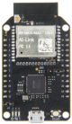
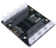

# Are CO2 levels making you happy, grumpy, sleepy, or sad

How to build a workspace health CO2, temperature, and humidity monitor with [Azure Sphere](https://azure.microsoft.com/en-gb/services/azure-sphere/), a SDC30 sensor and [Azure IoT Central](https://azure.microsoft.com/en-gb/services/iot-central/).

**Follow** me on **Twitter** [@dglover](https://twitter.com/dglover)

Working from home it is easy to close the door to shut out the noise of everyday life while we get on with work. Carbon dioxide is a byproduct of our breathing and closing the door can mean Carbon Dioxide (CO2) is building up in our work spaces which can really impacting on our wellbeing, concentration, and productivity levels.

| | |
|---|---|
||  |

For the science, then check out [The importance of Indoor Air Quality (IAQ) for Business Performance and Wellbeing](https://iotfactory.eu/the-importance-of-indoor-air-quality-iaq-for-business-performance-and-wellbeing/).

The problem is we can't see or smell Carbon Dioxide, it just keeps building up and we have no way of knowing it is happening. So with that in mind, I figured it was Internet of Things to the rescue!

## The solution

I wanted to build a secure IoT device with [Azure Sphere](https://azure.microsoft.com/en-gb/services/azure-sphere/) using the [Seeed Studio Grove CO2 & Temperature & Humidity Sensor](https://www.seeedstudio.com/Grove-CO2-Temperature-Humidity-Sensor-SCD30-p-2911.html) sensor I had in my box of bits. The folk at Sensirion made it super easy to port the [SCD30 driver](https://github.com/Sensirion/embedded-scd) Azure Sphere. It was really just a matter of implementing the I2C read and write functions and providing an implementation for microsecond sleep. It just worked!

I created a free trial of [Azure IoT Central](https://azure.microsoft.com/en-gb/services/iot-central/) and in no time I had CO2, temperature, and humidity telemetry displayed (yup, the data is real!). By the way, you can continue to connect two devices for free to IoT Central after the trail period expires.

## Parts list

The solution supports two configurations:

### Seeed Studio Azure Sphere Mini Dev Board

1. [Seeed Studio Seeed Studio MT3620 Mini Dev Board](https://www.seeedstudio.com/mt3620-for-azure-sphere)
2. [MT3620 Grove Breakout](https://www.seeedstudio.com/MT3620-Grove-Breakout-p-4043.html)
3. [Seeed Studio Grove CO2 & Temperature & Humidity Sensor](https://www.seeedstudio.com/Grove-CO2-Temperature-Humidity-Sensor-SCD30-p-2911.html)
4. Optional, [3 x Grove LEDs](), or a [Grove Relay](https://www.seeedstudio.com/Grove-Relay.html) to drive a bigger warning light!

### AVNET Azure Sphere Starter Kit

1. [AVNET Azure Sphere Starter Kit](https://www.avnet.com/shop/us/products/avnet-engineering-services/aes-ms-mt3620-sk-g-3074457345636825680/)
2. [Seeed Studio Grove CO2 & Temperature & Humidity Sensor](https://www.seeedstudio.com/Grove-CO2-Temperature-Humidity-Sensor-SCD30-p-2911.html)
3. Optional, 1 x [Click Relay](https://www.mikroe.com/relay-click) to drive a bigger warning light.

---

## What is Azure Sphere

Azure Sphere is a solution for securing MCU Power Devices. It comprises a secured, connected, crossover microcontroller unit (MCU), a custom high-level Linux-based operating system (OS), and a cloud-based security service that provides continuous, renewable security.

--

## Why Azure Sphere

As billions of new devices are connected, organizations need to secure them to help protect data, privacy, physical safety, and infrastructure. Azure Sphere builds on decades of Microsoft experience in hardware, software, and cloud to provide a turnkey solution for IoT devices. Azure Sphere is secure by design so you can build innovative IoT products that customers can use with confidence.

<!-- ---

## What is Azure Sphere

Azure Sphere is a solution for securing MCU Power Devices. It comprises a secured, connected, crossover microcontroller unit (MCU), a custom high-level Linux-based operating system (OS), and a cloud-based security service that provides continuous, renewable security.

 -->

---

## Azure Sphere Devices

For simplicity, only the LEDs and sensors built into the Azure Sphere developer boards are used in these labs. These labs do not require any expansion boards or extra sensors.

The following Azure Sphere developer boards are supported by these labs, and for completeness, links to expansion options for each developer board.

| [Avnet Azure Sphere MT3620 Starter Kit](https://www.avnet.com/shop/us/products/avnet-engineering-services/aes-ms-mt3620-sk-g-3074457345636825680/) |  [Seeed Studio Seeed Studio MT3620 Mini Dev Board](https://www.seeedstudio.com/mt3620-for-azure-sphere) |
| :-------------: | :---------------: | :-----: |
| [Reference](https://www.avnet.com/shop/us/products/avnet-engineering-services/aes-ms-mt3620-sk-g-3074457345636825680/) | [Reference](http://wiki.seeedstudio.com/MT3620_Mini_Dev_Board/) |
|  |  |
| [Mikroe Click Boards](https://www.mikroe.com/) and Seeed Studio Grove I2C  | [MT3620 Grove Breakout](https://www.seeedstudio.com/MT3620-Grove-Breakout-p-4043.html) |
|  |   |  |

<!-- --- -->

<!-- ## Supported Starter/Developer Kits

These labs support the following Azure Sphere Kits.

| Manufacturer | Image |
|---|---|
| [Avnet Azure Sphere MT3620 Starter Kit](https://www.avnet.com/shop/us/products/avnet-engineering-services/aes-ms-mt3620-sk-g-3074457345636825680/). This starter kit includes a 3D accelerometer, a 3D Gyro, along with temperature, pressure, and ambient light sensors. | |
| [Seeed Studio Azure Sphere MT3620 Development Kit](http://wiki.seeedstudio.com/Azure_Sphere_MT3620_Development_Kit/) |  |
| [Seeed Studio Azure Sphere MT3620 Mini Dev Board]() |  | -->

